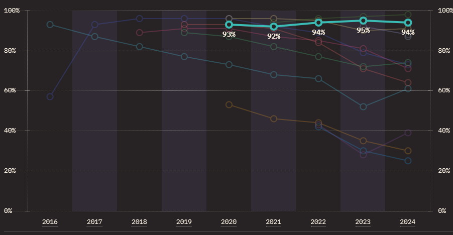

# Introduction
Playwright is an open-source browser automation and end-to-end (e2e) testing framework. It can also be used as a general purpose browser automation library for web scraping. Test on Windows, Linux, and macOS, locally or on CI, headless or headed with native mobile emulation.

Playwright was developed and is maintained by Microsoft, but it is open to contributions from the community. 

Read more on official website [playwright](https://playwright.dev/)

Some of the features that set playwright apart from its competitors are: 
* **Unified API for cross-browser testing:** Playwright provides built-in support for Chromium, Firefox, and WebKit (Safari) browsers out of the box. 
* **Automatic Waits and Reliability:** Playwright automatically handles waiting for elements, network requests, and other page events, making it more reliable and less prone to flakiness compared to tools that require manual waiting or timeouts.
* **Robust Debugging and Tracing:** Playwright provides advanced debugging features, including the ability to generate video recordings, screenshots, and detailed trace files to help diagnose and debug issues. 
* **Specialized Test Runner:** Playwright comes with a dedicated test runner (@playwright/test) that integrates seamlessly with the Playwright API, providing a more comprehensive testing solution compared to using a generic test framework like Mocha or Jest. 
* **Browser Context Isolation:** Playwright isolates each test case in its own browser context, preventing interference between tests and improving the reliability of end-to-end tests. 
* **Network Interception:** Playwright allows you to intercept and modify network requests, enabling scenarios like mocking API responses, simulating network failures, and more. 
* **Parallel Test Execution:** Playwright supports running tests in parallel across multiple browsers and instances, improving test execution speed. 
* **Codegen Feature:** Codegen allows Playwright to generate boilerplate code for common actions, such as clicking on elements, filling out forms, and navigating to pages. This can significantly speed up the process of writing test automation scripts.
* **Ease of Use:** Playwright aims to provide a more intuitive and developer-friendly API compared to tools like Selenium, which can have a steeper learning curve. 

# Competitor e2e testing frameworks
* [Testsigma](https://testsigma.com/)
* [Puppeteer](https://pptr.dev/)
* [Cypress](https://www.cypress.io/)
* [Selenium](https://www.selenium.dev/)
* [BrowserStack](https://www.browserstack.com/)

# Playwright popularity
Source: [State of JS 2024](https://2024.stateofjs.com/en-US/libraries/testing/)
 

# Languages supported by playwright
Playwright supports writing tests in Javascript, Python, Java and .NET

